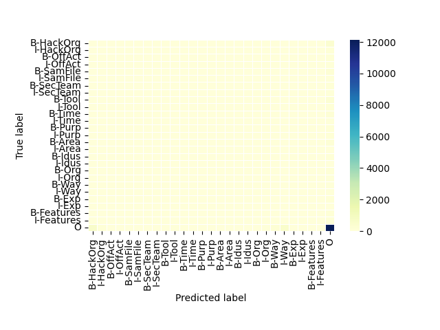
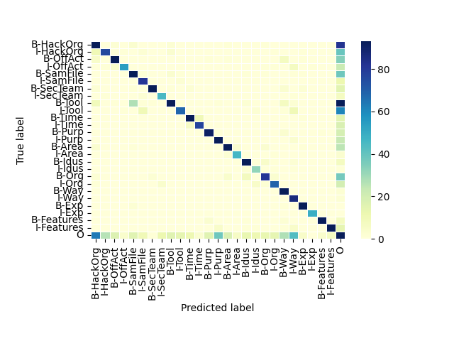
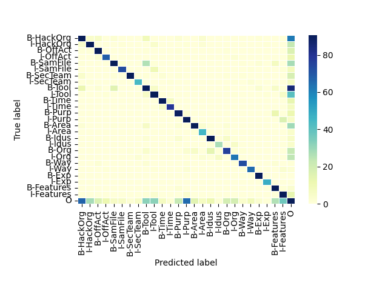

# 模型训练记录

2022.01.18

Roberta太慢了，可能要等两三天

重写LSTM试试

数据集DNRTi

## 2022_01_18lstmcrf_01

batchsize 1

dev03

cuda:1

没有使用embedding

```
INFO:root:epoch: 1
INFO:root:loss_train: 23.479919, loss_valid: 21.929972
INFO:root:>>>model saved 2022_01_18lstmcrf_01<<<
INFO:root:epoch: 2
INFO:root:loss_train: 21.264976, loss_valid: 21.649941
INFO:root:>>>model saved 2022_01_18lstmcrf_01<<<
INFO:root:epoch: 3
INFO:root:loss_train: 21.370904, loss_valid: 21.579493
```

***不加入embedding的效果差得显著，停止训练***

# 2022_01_18lstmcrf_02

batchsize 1

dev03

cude:1

使用embedding

单层LSTM

```
root:loss_train: 11.153680, loss_valid: 7.918970

              precision    recall  f1-score   support

   B-HackOrg       0.02      0.03      0.02       368
   I-HackOrg       0.00      0.00      0.00       133
    B-OffAct       0.00      0.00      0.00       150
    I-OffAct       0.00      0.00      0.00        91
   B-SamFile       0.00      0.00      0.00       248
   I-SamFile       0.00      0.00      0.00        95
   B-SecTeam       0.15      0.02      0.03       152
   I-SecTeam       0.00      0.00      0.00        56
      B-Tool       0.03      0.00      0.01       312
      I-Tool       0.01      0.01      0.01       153
      B-Time       0.00      0.00      0.00       167
      I-Time       0.00      0.00      0.00       101
      B-Purp       0.00      0.00      0.00       115
      I-Purp       0.00      0.00      0.00       145
      B-Area       0.00      0.00      0.00       216
      I-Area       0.00      0.00      0.00        52
      B-Idus       0.00      0.00      0.00       127
      I-Idus       0.00      0.00      0.00        38
       B-Org       0.00      0.00      0.00       137
       I-Org       0.00      0.00      0.00       101
       B-Way       0.00      0.00      0.00        98
       I-Way       0.00      0.01      0.00        88
       B-Exp       0.00      0.00      0.00       132
       I-Exp       0.00      0.00      0.00        49
  B-Features       0.00      0.00      0.00       116
  I-Features       0.00      0.00      0.00       151
           O       0.79      0.86      0.83     14093

    accuracy                           0.69     17684
   macro avg       0.04      0.03      0.03     17684
weighted avg       0.63      0.69      0.66     17684


Process finished with exit code 0

```



这里的embedding放在了MakeDataSet

我再试试把它放在模型里面

唉，embedding层是需要训练的，所以必须放在模型内！！！

这里用了双层LSTM

```
              precision    recall  f1-score   support

   B-HackOrg       0.74      0.75      0.75       368
   I-HackOrg       0.73      0.57      0.64       133
    B-OffAct       0.81      0.67      0.73       150
    I-OffAct       0.90      0.59      0.72        91
   B-SamFile       0.80      0.81      0.81       248
   I-SamFile       0.76      0.85      0.80        95
   B-SecTeam       0.97      0.83      0.89       152
   I-SecTeam       0.74      0.80      0.77        56
      B-Tool       0.86      0.47      0.61       312
      I-Tool       0.79      0.44      0.57       153
      B-Time       0.88      0.84      0.86       167
      I-Time       0.86      0.76      0.81       101
      B-Purp       0.82      0.79      0.81       115
      I-Purp       0.73      0.82      0.77       145
      B-Area       0.87      0.83      0.85       216
      I-Area       0.84      0.88      0.86        52
      B-Idus       0.80      0.87      0.83       127
      I-Idus       0.62      0.84      0.71        38
       B-Org       0.75      0.59      0.66       137
       I-Org       0.76      0.68      0.72       101
       B-Way       0.65      0.98      0.78        98
       I-Way       0.53      0.98      0.69        88
       B-Exp       0.91      0.98      0.95       132
       I-Exp       0.98      1.00      0.99        49
  B-Features       0.95      0.89      0.92       116
  I-Features       0.95      0.82      0.88       151
           O       0.96      0.97      0.96     14093

    accuracy                           0.93     17684
   macro avg       0.81      0.79      0.79     17684
weighted avg       0.93      0.93      0.93     17684


Process finished with exit code 0

```



## 2022_01_19lstmcrf_01

按词加载数据，每512个词为一句话

batchsize 1

dev03

cude:1

使用embedding

双层LSTM

```
              precision    recall  f1-score   support

   B-HackOrg       0.75      0.75      0.75       358
   I-HackOrg       0.73      0.72      0.73       129
    B-OffAct       0.81      0.85      0.83       145
    I-OffAct       0.84      0.80      0.82        85
   B-SamFile       0.88      0.72      0.79       246
   I-SamFile       0.90      0.78      0.84        93
   B-SecTeam       0.98      0.81      0.88       152
   I-SecTeam       0.86      0.79      0.82        56
      B-Tool       0.67      0.58      0.62       309
      I-Tool       0.63      0.64      0.64       151
      B-Time       0.91      0.88      0.89       163
      I-Time       0.89      0.87      0.88        91
      B-Purp       0.72      0.78      0.75       114
      I-Purp       0.61      0.85      0.71       143
      B-Area       0.88      0.78      0.83       213
      I-Area       0.73      0.87      0.79        52
      B-Idus       0.79      0.86      0.82       123
      I-Idus       0.73      0.73      0.73        37
       B-Org       0.72      0.58      0.64       131
       I-Org       0.67      0.64      0.66        98
       B-Way       0.91      0.90      0.91        81
       I-Way       0.84      0.88      0.86        74
       B-Exp       0.94      1.00      0.97       131
       I-Exp       0.94      1.00      0.97        48
  B-Features       0.68      0.94      0.79       116
  I-Features       0.67      0.87      0.76       151
           O       0.97      0.97      0.97     13918

    accuracy                           0.93     17408
   macro avg       0.80      0.81      0.80     17408
weighted avg       0.93      0.93      0.93     17408
```



效果变得更好了一点！！


按词加载数据，每1024个词为一句话

batchsize 1

dev03

cude:2

使用embedding

双层LSTM

```
              precision    recall  f1-score   support

   B-HackOrg       0.75      0.79      0.77       358
   I-HackOrg       0.75      0.66      0.70       129
    B-OffAct       0.84      0.53      0.65       145
    I-OffAct       0.87      0.61      0.72        85
   B-SamFile       0.82      0.85      0.83       246
   I-SamFile       0.87      0.89      0.88        93
   B-SecTeam       0.95      0.82      0.88       152
   I-SecTeam       0.88      0.77      0.82        56
      B-Tool       0.78      0.61      0.69       309
      I-Tool       0.76      0.64      0.70       151
      B-Time       0.91      0.90      0.90       163
      I-Time       0.93      0.82      0.87        91
      B-Purp       0.82      0.89      0.86       114
      I-Purp       0.75      0.91      0.82       143
      B-Area       0.88      0.76      0.81       213
      I-Area       0.76      0.85      0.80        52
      B-Idus       0.90      0.90      0.90       123
      I-Idus       0.78      0.95      0.85        37
       B-Org       0.65      0.70      0.67       131
       I-Org       0.70      0.77      0.73        98
       B-Way       0.82      0.99      0.89        81
       I-Way       0.82      0.99      0.90        74
       B-Exp       0.96      1.00      0.98       131
       I-Exp       0.98      1.00      0.99        48
  B-Features       0.80      0.97      0.88       116
  I-Features       0.83      0.95      0.89       151
           O       0.97      0.97      0.97     13918

    accuracy                           0.94     17408
   macro avg       0.83      0.83      0.83     17408
weighted avg       0.94      0.94      0.94     17408


Process finished with exit code 0

```

0.94, 又变好了一点点。

最后在炼一个，结果见2022.01.19号记录
