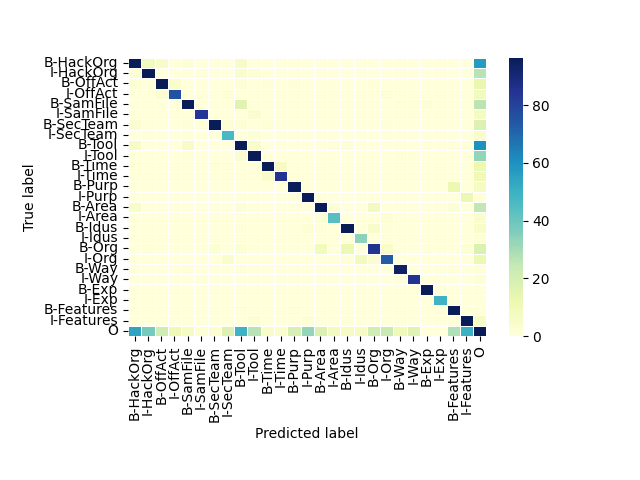

# 模型训练记录

2022.01.19

按词加载训练

## 2022_01_19lstmcrf_02

```
EMBEDDING_DIM = 128
HIDDEN_DIM = 512
SENT_LEN = 512
NUM_LAYERS = 2
epoch: 5
loss_train: 58.126266, loss_valid: 131.299101
>>>model saved 2022_01_19lstmcrf_02<<<
```

```
              precision    recall  f1-score   support

   B-HackOrg       0.80      0.79      0.79       368
   I-HackOrg       0.67      0.73      0.70       133
    B-OffAct       0.81      0.84      0.82       150
    I-OffAct       0.84      0.84      0.84        91
   B-SamFile       0.91      0.81      0.86       248
   I-SamFile       0.94      0.88      0.91        95
   B-SecTeam       0.95      0.82      0.88       152
   I-SecTeam       0.64      0.84      0.72        56
      B-Tool       0.72      0.73      0.73       312
      I-Tool       0.74      0.75      0.74       153
      B-Time       0.92      0.87      0.90       167
      I-Time       0.89      0.84      0.86       101
      B-Purp       0.82      0.83      0.83       115
      I-Purp       0.78      0.91      0.84       145
      B-Area       0.85      0.80      0.82       216
      I-Area       0.80      0.85      0.82        52
      B-Idus       0.82      0.88      0.85       127
      I-Idus       0.69      0.89      0.78        38
       B-Org       0.69      0.62      0.65       137
       I-Org       0.67      0.72      0.70       101
       B-Way       0.89      0.96      0.92        98
       I-Way       0.82      0.97      0.89        88
       B-Exp       0.97      1.00      0.99       132
       I-Exp       1.00      1.00      1.00        49
  B-Features       0.72      0.98      0.83       116
  I-Features       0.68      0.92      0.78       151
           O       0.97      0.97      0.97     14093

    accuracy                           0.94     17684
   macro avg       0.81      0.85      0.83     17684
weighted avg       0.94      0.94      0.94     17684
```


